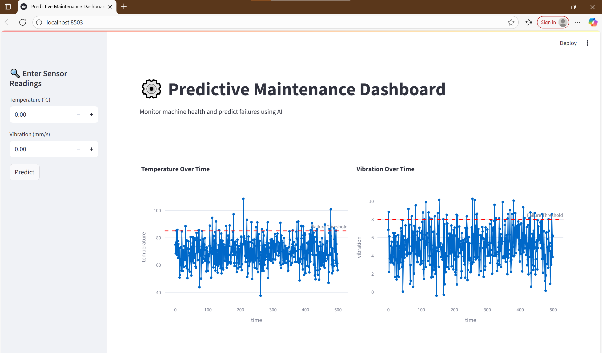

# Predictive_maintenance_dashboard
A predictive maintenance dashboard is a user interface that visualizes data to predict potential equipment failures and enable proactive maintenance, minimizing downtime and optimizing maintenance schedules. It serves as a centralized tool for monitoring, analysis, and reporting, empowering industries to achieve higher efficiency, safety, and cost-effectiveness in their operations.

Features
Visualizes sensor data and prediction results
- Trained ML model (`pdm_model.pkl`) for failure prediction
- Interactive dashboard built with Flask
- Uses sample dataset (`sensor_data.csv`)

